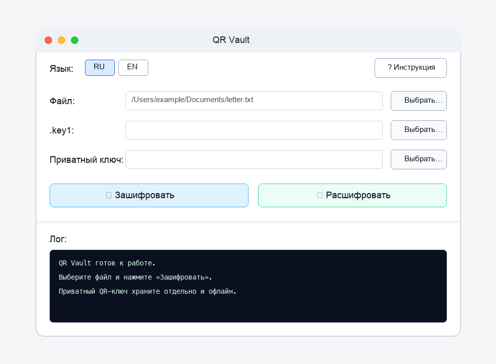

# QR Vault 🔐

**Release:** v0.3



QR Vault is a small local tool for encrypting files with hybrid RSA + AES encryption and exporting RSA keys as QR codes.

**Core idea:** encrypt a file → get `.enc` + `.key1` + RSA keys (PEM + QR images). To decrypt, you need the `.enc` file, the `.key1` file, and the private RSA key.

The private key QR can be printed on paper and stored in a safe — useful for digital inheritance / emergency handover scenarios.

## Features

- Local-only encryption: no network, no cloud, no accounts.
- Hybrid encryption:
  - new files: AES-256-GCM for file contents;
  - RSA-2048-OAEP + SHA-256 for AES key wrapping.
- Legacy decrypt support for older AES-256-CFB files created by the original version.
- QR code generation for public and private RSA keys.
- Cross-platform GUI with tkinter: Linux, macOS, Windows.
- Optional legacy GTK4 GUI for Linux.
- CLI interface for scripting.

## Security notes — read this first

- `private_key.pem` and `*_private_key_qr.png` are the main secrets. Anyone who gets them together with `.enc` + `.key1` can decrypt the file.
- The private key is currently saved without a password. Store it offline, print it, or keep it in a safe place.
- Do not commit generated keys, QR images, `.enc`, `.key1`, or source documents to Git.
- This project has not had an independent cryptographic audit.
- For critical legal, medical, or financial documents, test decryption before relying on the archive.

## Quick start

### Install dependencies

```bash
python -m pip install -r requirements.txt
```

### Run GUI (tkinter — recommended on all platforms)

```bash
python qr_gui_tk.py
```

On Linux/macOS you can also run:

```bash
./run-qr-gui-tk.sh
```

### Run legacy GTK4 GUI (Linux only, optional)

```bash
sudo apt install python3-gi gir1.2-gtk-4.0
python -m pip install -r requirements-gtk.txt
./run-qr-gui.sh
```

### CLI usage

```bash
# Encrypt
python qr_crypto.py --encrypt --file secret.txt

# Decrypt
python qr_crypto.py --decrypt --file secret.txt.enc --key1 secret.txt.key1 --keyfile secret_private_key.pem
```

## File outputs

| File | Description |
| --- | --- |
| `*.enc` | Encrypted file (`QRC1` + nonce + ciphertext + authentication tag for new files) |
| `*.key1` | AES key encrypted with the RSA public key |
| `*_private_key.pem` | RSA private key — keep secret |
| `*_public_key.pem` | RSA public key |
| `*_private_key_qr.png` | RSA private key as QR — keep secret |
| `*_public_key_qr.png` | RSA public key as QR |

If an output file already exists, QR Vault writes a numbered variant instead of silently overwriting it.

## Digital inheritance scenario

1. Write a farewell letter or save important instructions: accounts, domains, seed phrases, emergency contacts, document locations.
2. Encrypt the file with QR Vault.
3. Print `*_private_key_qr.png` and store it in a safe / with a trusted person.
4. Store or send `.enc` + `.key1` separately, for example through a dead man's switch.
5. When needed, the recipient scans the QR, restores `private_key.pem`, and decrypts the file.

## Development

Run the smoke test:

```bash
python tests/smoke_test.py
```

CI runs the smoke test on Linux, macOS, and Windows for Python 3.10–3.13.

Release binaries are built by GitHub Actions when pushing a tag like `v0.3`.

## License

MIT License.

---

# QR Vault 🔐 (Русский)

**Релиз:** v0.3


QR Vault — маленький локальный инструмент для шифрования файлов гибридной схемой RSA + AES и экспорта RSA-ключей в QR-коды.

**Идея:** зашифровать файл → получить `.enc` + `.key1` + RSA-ключи (PEM + QR-картинки). Для расшифровки нужны `.enc`, `.key1` и приватный RSA-ключ.

QR приватного ключа можно распечатать на бумаге и хранить в сейфе — это удобно для цифрового наследства / экстренной передачи доступа.

## Возможности

- Полностью локальная работа: без сети, облака и аккаунтов.
- Гибридное шифрование:
  - новые файлы: AES-256-GCM для содержимого файла;
  - RSA-2048-OAEP + SHA-256 для упаковки AES-ключа.
- Поддержка расшифровки старых AES-256-CFB файлов, созданных оригинальной версией.
- Генерация QR-кодов для публичного и приватного RSA-ключа.
- Кроссплатформенный GUI на tkinter: Linux, macOS, Windows.
- Опциональный legacy GTK4 GUI для Linux.
- CLI для скриптов.

## Безопасность — прочитайте сначала

- `private_key.pem` и `*_private_key_qr.png` — главные секреты. Любой, кто получит их вместе с `.enc` + `.key1`, сможет расшифровать файл.
- Приватный ключ сейчас сохраняется без пароля. Храните его офлайн, печатайте или держите в безопасном месте.
- Не коммитьте сгенерированные ключи, QR-коды, `.enc`, `.key1` и исходные документы в Git.
- Проект не проходил независимый криптографический аудит.
- Для критичных юридических, медицинских или финансовых документов обязательно заранее проверьте расшифровку.

## Быстрый старт

### Установка зависимостей

```bash
python -m pip install -r requirements.txt
```

### Запуск GUI (tkinter — рекомендовано на всех платформах)

```bash
python qr_gui_tk.py
```

На Linux/macOS также можно:

```bash
./run-qr-gui-tk.sh
```

### Legacy GTK4 GUI (только Linux, опционально)

```bash
sudo apt install python3-gi gir1.2-gtk-4.0
python -m pip install -r requirements-gtk.txt
./run-qr-gui.sh
```

### CLI

```bash
# Зашифровать
python qr_crypto.py --encrypt --file secret.txt

# Расшифровать
python qr_crypto.py --decrypt --file secret.txt.enc --key1 secret.txt.key1 --keyfile secret_private_key.pem
```

## Выходные файлы

| Файл | Описание |
| --- | --- |
| `*.enc` | Зашифрованный файл (`QRC1` + nonce + ciphertext + authentication tag для новых файлов) |
| `*.key1` | AES-ключ, зашифрованный RSA public key |
| `*_private_key.pem` | RSA private key — хранить в секрете |
| `*_public_key.pem` | RSA public key |
| `*_private_key_qr.png` | RSA private key в QR — хранить в секрете |
| `*_public_key_qr.png` | RSA public key в QR |

Если выходной файл уже существует, QR Vault создаёт нумерованную копию и не перезаписывает его молча.

## Сценарий: цифровое наследство

1. Напишите письмо или сохраните важные инструкции: аккаунты, домены, seed-фразы, контакты, где лежат документы.
2. Зашифруйте файл через QR Vault.
3. Распечатайте `*_private_key_qr.png` и храните в сейфе / у доверенного лица.
4. `.enc` + `.key1` храните или отправьте отдельно, например через dead man's switch.
5. Когда потребуется, получатель сканирует QR, восстанавливает `private_key.pem` и расшифровывает файл.

## Разработка

Smoke-test:

```bash
python tests/smoke_test.py
```

CI проверяет smoke-test на Linux, macOS и Windows для Python 3.10–3.13.

Release-бинарники собираются GitHub Actions при пуше тега вроде `v0.3`.

## Лицензия

MIT License.
